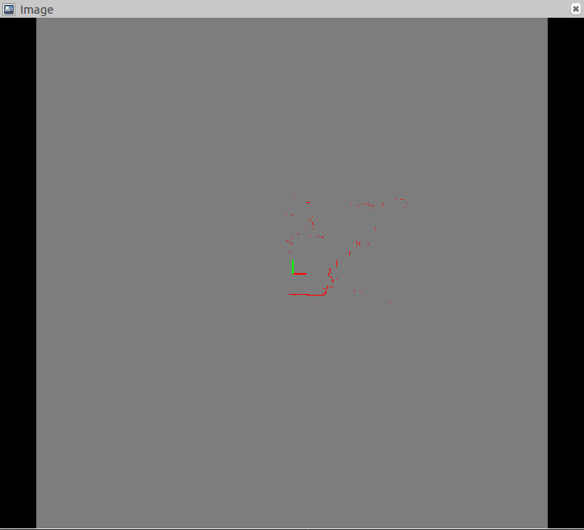

# laserscan_to_image

This Project is aimed to convert Laser data from **sensor_msgs/LaserScan** to **sensor_msgs/Image**. It subscribe the origin Laser data of **sensor_msgs/LaserScan** data type, convert it to **sensor_msgs/Image** data type, and publish it out.

# How to use
* modify **launch/laserscan_to_image.launch** based on your own project.
* open a terminal, execute the command below
```
roslaunch laserscan_to_image laserscan_to_image.launch
```

# parameters

**laserscan_topic**: Origin laser topic name, the data type is **sensor_msgs/LaserScan**.

**image_pub_topic**: Converted laser date topic name to publish to, the data type is **sensor_msgs/Image**;

**image_resolution**: The Converted resolution, the unit is meters per pix(m/pix);

# demo
Result will show as below.


